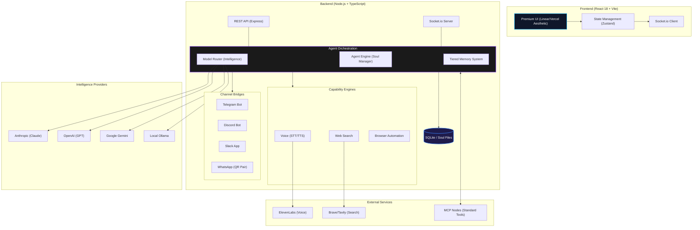
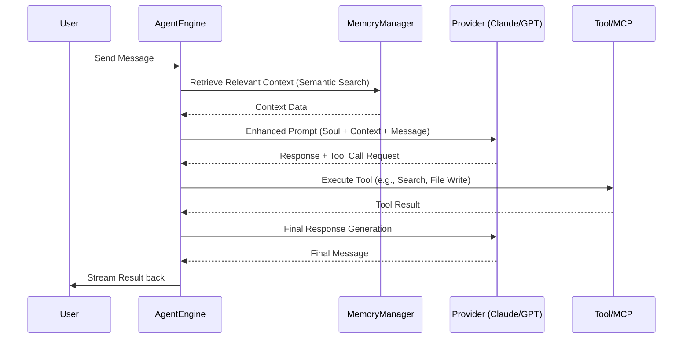

# 🏗️ OpenPaw System Architecture

This document provides a technical overview of the OpenPaw platform architecture, data flows, and core systems.

---

## 1. System Overview

OpenPaw uses a **Local-First Distributed** architecture:
- **Client**: A heavy React SPA that handles UI, state management, and real-time visualization.
- **Server**: A Node.js backend that handles agent orchestration, LLM provider routing, and persistent storage.
- **Database**: SQLite for lightweight, portable, and fast local persistence.

---

## 2. Core Components

### 🧠 Agent Engine
The heart of OpenPaw. It manages the lifecycle of an agent and its "Soul Files".
- **Soul Manager**: Handles reading/writing the 8 core Markdown files.
- **Context Constructor**: Aggregates identity, memory, and task context into LLM prompts.
- **Action Dispatcher**: Executes skills or MCP tools requested by the agent.

### 🔌 Model Router
A provider-agnostic layer that facilitates communication with different LLM vendors.
- **Supported Providers**: Anthropic (Claude), OpenAI (GPT), Google (Gemini), Ollama (Local).
- **Task Overrides**: Ability to route different tasks (e.g., coding vs. research) to different models.

### 📡 Channel Bridges
Stateless bridges connecting OpenPaw agents to external messaging platforms.
- **Socket.io**: Used for real-time communication between the server and the web client.
- **Webhooks/Polling**: Used for Telegram, Discord, and Slack integrations.
- **Local Sessions**: WhatsApp integration via QR code pairing.

---

## 3. Data Architecture

### Database Schema (SQLite)
OpenPaw uses a relational schema to manage the complex relationships between agents, tasks, and memories.
- **memories**: Tiered storage (hot, episodic, semantic) with importance scoring.
- **tasks**: States include `bidding`, `assigned`, `in_progress`, `completed`.
- **cron_jobs**: Managed by a persistent scheduler for autonomous agent actions.

### Soul Files (Markdown)
Agents are portable. All personality and memory data is stored as human-readable Markdown files in the `server/storage` (or similar) directory, allowing for Git-based versioning.

---

## 4. Security & Privacy

- **Local Persistence**: Data stays on your machine (SQLite + local files).
- **Credential Masking**: API keys are masked in the UI and stored encrypted at rest.
- **Environment Isolation**: MCP tools run in isolated processes or via controlled network bridges.

---

## 5. System Components Diagram

---

## 6. Sequence: Agent Reasoning Loop

---

## 6. Development Guidelines

### Adding a New Skill
1. Define the skill logic in `server/src/skills`.
2. Register the skill in the `SkillRegistry`.
3. Update the frontend `Skills.tsx` to handle the new skill's configuration.

### Creating a New Page
1. Add a new route in `App.tsx`.
2. Use the established design system tokens (refer to `tailwind.config.cjs`).
3. Follow the **Linear app aesthetic**: High contrast, subtle borders, and micro-animations.
